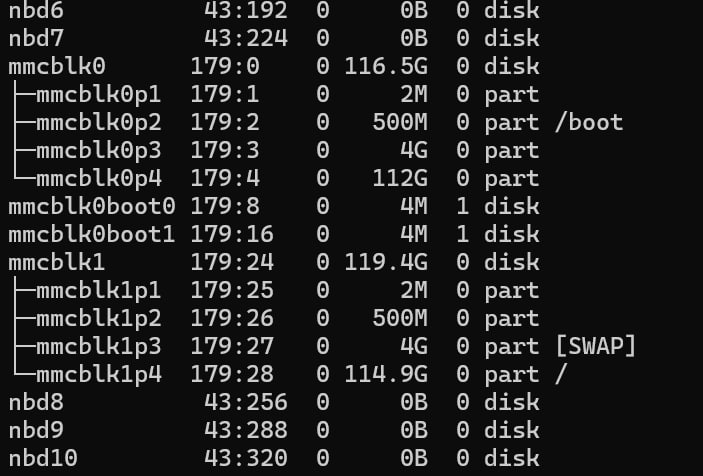

## openEuler 24.03 Lichee pi 4A SD卡镜像

### 合成方法

首先下载需要的`lpi4a-base-boot.ext4`和`lpi4a-base-root.ext4`

然后创建镜像文件，并挂载为loop设备，进行烧录

需要分成四个分区，分别是一个空分区，一个boot分区，一个swap分区，一个rootfs分区

实际上不会用到boot分区内的内核，启动的时候用的是从eMMC里的boot分区启动的，sd卡只使用其swap和rootfs。

刷入之前需要烧录`lpi4a-base-boot.ext4`，并且需要修改boot分区下的`/extlinux/extlinux.conf`文件。

```
         menu title U-Boot menu for openEuler RISC-V TH1520
         timeout 50
         default openEuler-riscv

         label openEuler-riscv
                 menu label Linux openEuler-riscv
                 kernel /vmlinuz-6.6.0-72.0.0.76.oe2403sp1.riscv64
                 fdtdir /dtb-6.6.0-72.0.0.76.oe2403sp1.riscv64
                 append root=/dev/mmcblk1p4 console=ttyS0,115200 rootwait rw earlycon clk_ignore_unused loglevel=7 eth= rootrwoptions=rw,noatime rootrwreset=yes selinux=0
```

主要是把`append root=/dev/mmcblk0p4`替换成`append root=/dev/mmcblk1p4`，让其从sd卡的第4分区启动，其中mmcblk0是eMMC，mmcblk1是SD卡

使用下面的命令合成sd卡烧录镜像

```bash
truncate -s 12G openEuler-24.03-LTS-SP1-riscv64-lpi4a-base-sdcard.img
parted openEuler-24.03-LTS-SP1-riscv64-lpi4a-base-sdcard.img mklabel gpt
parted openEuler-24.03-LTS-SP1-riscv64-lpi4a-base-sdcard.img mkpart primary 1MiB 3MiB  
parted openEuler-24.03-LTS-SP1-riscv64-lpi4a-base-sdcard.img mkpart primary ext4 3MiB 503MiB
parted openEuler-24.03-LTS-SP1-riscv64-lpi4a-base-sdcard.img mkpart primary linux-swap 503MiB 4600MiB  
parted openEuler-24.03-LTS-SP1-riscv64-lpi4a-base-sdcard.img mkpart primary ext4 4600MiB 100%  
sudo losetup -Pf openEuler-24.03-LTS-SP1-riscv64-lpi4a-base-sdcard.img 
lsblk
sudo dd if=openEuler-24.03-LTS-SP1-riscv64-lpi4a-base-boot.ext4 of=/dev/loop14p2 bs=4M status=progress
sudo dd if=openEuler-24.03-LTS-SP1-riscv64-lpi4a-base-root.ext4 of=/dev/loop14p4 bs=4M status=progress
lsblk
sudo mkswap /dev/loop14p3
sudo swaplabel --uuid 5ebcaaf0-e098-43b9-beef-1f8deedd135f /dev/loop14p3
sudo losetup -d /dev/loop14
```

制作完成后，用dd或者windows上的软件烧录到sd卡，然后插入PC，使用fdisk扩展分区

或者直接下载仓库release界面的镜像

需要解压后才能烧录，Windows系统请使用[7-Zip-zstd](https://github.com/mcmilk/7-Zip-zstd/releases)，Linux系统直接使用`zstd -d`命令解压

先输入p查看当前分区表，然后记录分区4的起始地址，然后输入d删除分区4，然后n创建一个新分区4，起始地址用之前的，结束地址默认是最后，然后w写入分区表，q退出

再用`resize2fs /dev/sdX4`刷新分区大小

然后插入lp4a，uboot会从sd卡启动rootfs



登录用户名和密码如下

- 用户名：`root`

- 密码：`openEuler12#$`
